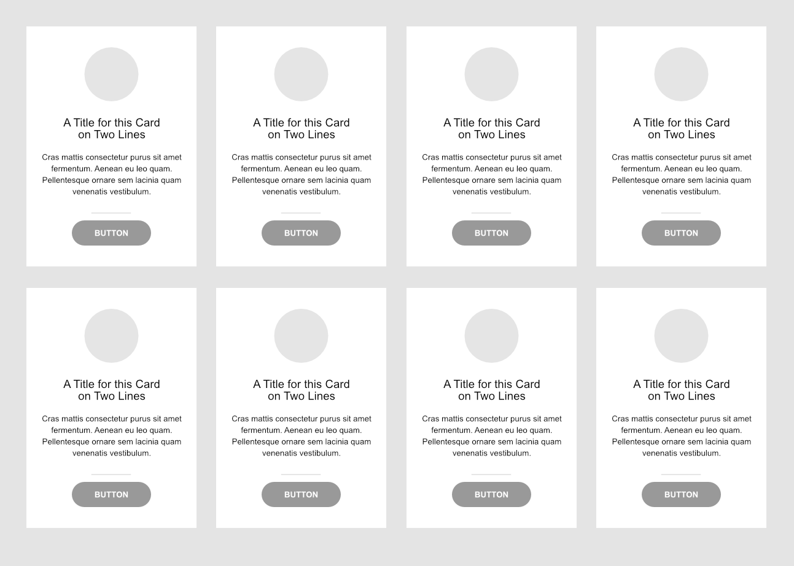

# CSS Frameworks

- Repository name: `css-framework-challenge`
- Owner: [Muhammad Fawad Rafique](https://github.com/fawadrafique)
- Type of Challenge: `Learning CSS frameworks`

Challenge is to build an interactive and responsive **HTML** page in accordance with the provided wireframe and using **CSS** framework of your choice.

## Exercise 1

- Framework used: `Bootsrap 4`
- GitHub Page: [Click here](https://fawadrafique.github.io/css-framework-challenge/exercise1.html)

## Exercise 2

- Framework used: `Tailwind`
- GitHub Page: [Click here](https://fawadrafique.github.io/css-framework-challenge/exercise2.html)

